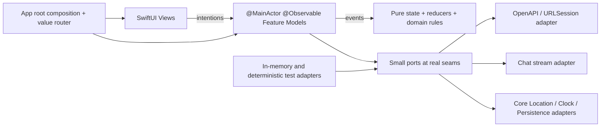

# Architecture iOS SwiftUI de production : décision MVC/MVVM et plan de migration de Via

Date de vérification : 14 août 2026.

## Décision en une phrase

**Recommandation : choisir un MVVM pragmatique, organisé par fonctionnalité et renforcé par des reducers purs pour les flows complexes.** Une `View` SwiftUI reste une projection déclarative légère ; un modèle de fonctionnalité `@MainActor @Observable` porte l'état de présentation et les commandes ; les règles métier restent dans des types valeur et fonctions pures ; les effets passent par quelques seams réelles vers des adapters de production et de test. Il ne faut ni recréer des view controllers UIKit pour faire du MVC, ni imposer un `ViewModel` à chaque petite `View`.

Cette décision est une **recommandation**, pas une prescription Apple : SwiftUI ne déclare pas qu'une app doit suivre MVC ou MVVM. Elle découle du modèle de données SwiftUI, de la forme actuelle de Via et des risques d'une migration de production.

## Méthode et niveau de preuve

Les marqueurs employés dans ce document sont les suivants :

- **Fait sourcé** : comportement ou capacité explicitement documenté par Apple, Swift.org ou, pour la définition conventionnelle de MVVM, Microsoft.
- **Observation Via** : constat tiré du dépôt à la date ci-dessus.
- **Inférence** : conséquence technique tirée des faits et observations ; elle reste réfutable par un prototype ou une mesure.
- **Recommandation** : choix proposé pour Via, avec ses compromis.

La [discussion Stack Overflow indiquée par le demandeur](https://stackoverflow.com/questions/667781/what-is-the-difference-between-mvc-and-mvvm) a été lue uniquement comme contexte : elle illustre surtout l'ambiguïté des termes et le désaccord sur la place d'un controller dans MVVM. Aucune conclusion technique ci-dessous ne repose sur ses réponses.

## 1. Ce que disent réellement les sources primaires

### MVC, MVVM et SwiftUI

**Fait sourcé — MVC Cocoa.** Apple définit MVC comme trois rôles : le modèle encapsule les données et leurs comportements fondamentaux, la vue les affiche, et le controller sert d'intermédiaire ou coordonne l'application. Apple distingue aussi les controllers médiateurs des controllers de coordination. Cette documentation appartient aux archives Cocoa et ne constitue pas un guide SwiftUI contemporain, mais elle reste la définition Apple du pattern : [Model-View-Controller](https://developer.apple.com/library/archive/documentation/General/Conceptual/CocoaEncyclopedia/Model-View-Controller/Model-View-Controller.html).

**Fait sourcé — MVVM conventionnel.** La documentation Microsoft définit le ViewModel comme l'état et la logique de présentation exposés à une vue par propriétés et commandes, sans dépendance à la représentation visuelle ; le modèle conserve données et logique métier. C'est la source propriétaire du pattern, utilisée ici uniquement pour fixer le vocabulaire : [Model-View-ViewModel](https://learn.microsoft.com/en-gb/dotnet/architecture/maui/mvvm).

**Fait sourcé — data flow SwiftUI.** Apple demande de raisonner, pour chaque vue, sur les données nécessaires, leur mutation et leur source de vérité. Les valeurs passées par un parent peuvent rester des propriétés ordinaires ; l'état local appartient à `@State` ; les groupes de propriétés liées peuvent être extraits dans des types valeur qui maintiennent leurs invariants et sont testables indépendamment. Une `View` SwiftUI est recréée et sert à décrire le rendu, alors que SwiftUI conserve le stockage d'état : [Data Essentials in SwiftUI](https://developer.apple.com/videos/play/wwdc2020/10040/).

**Fait sourcé — Observation.** À partir d'iOS 17, SwiftUI prend en charge Observation. Avec `@Observable`, SwiftUI suit les propriétés effectivement lues par `body` ; `@State` gère un modèle possédé par la vue, `@Environment` propage un modèle partagé et `@Bindable` crée les bindings nécessaires. Apple documente une migration incrémentale et la coexistence temporaire avec `ObservableObject` : [Migrating from ObservableObject to the Observable macro](https://developer.apple.com/documentation/swiftui/migrating-from-the-observable-object-protocol-to-the-observable-macro), [Discover Observation in SwiftUI](https://developer.apple.com/videos/play/wwdc2023/10149/).

**Fait sourcé — compatibilité antérieure.** Pour un minimum de déploiement antérieur à iOS 17, Apple renvoie vers `ObservableObject`, `@Published`, `@StateObject` et `@ObservedObject` : [Monitoring model data changes in your app](https://developer.apple.com/documentation/swiftui/monitoring-model-data-changes-in-your-app).

**Inférence.** SwiftUI fournit déjà la synchronisation déclarative que le controller médiateur effectuait dans une app Cocoa classique. Ajouter un controller impératif par écran créerait souvent une deuxième autorité sur l'état. Le rôle utile d'un controller subsiste pour la coordination de navigation ou l'interopérabilité UIKit, pas comme conteneur obligatoire de toute logique de présentation.

### Navigation et cycle de vie

**Fait sourcé.** `NavigationStack` peut exposer son état sous forme de collection de valeurs. Apple recommande des éléments de chemin légers, déconseille d'utiliser le path comme transport de modèles complets, et documente sa sérialisation pour la restauration d'état : [Understanding the navigation stack](https://developer.apple.com/documentation/swiftui/understanding-the-navigation-stack), [NavigationStack](https://developer.apple.com/documentation/swiftui/navigationstack).

**Fait sourcé.** Une tâche lancée avec `.task(id:)` est annulée lorsque l'identité change et peut être annulée lorsque la vue disparaît : [`task(id:priority:_:)`](https://developer.apple.com/documentation/swiftui/view/task%28id%3Apriority%3A_%3A%29). La cancellation est coopérative ; elle ne dispense pas de vérifier que les adapters réseau et parseurs la propagent.

**Recommandation.** Représenter les destinations par un `enum AppRoute: Hashable, Codable` contenant uniquement des identifiants ou paramètres légers. Les modèles de fonctionnalité rechargent les données à partir de ces identifiants. Garder l'état de navigation à la racine de la scène, et l'état transitoire propre à chaque fonctionnalité dans son modèle.

### Concurrence

**Fait sourcé.** Apple recommande d'isoler les modèles qui pilotent SwiftUI sur le main actor ; Swift 6 utilise l'isolation et `Sendable` pour détecter des risques de data race à la compilation : [Discover concurrency in SwiftUI](https://developer.apple.com/videos/play/wwdc2021/10019/), [Data Race Safety](https://www.swift.org/migration/documentation/swift-6-concurrency-migration-guide/dataracesafety/).

**Recommandation.** Compiler en mode Swift 6 avec vérification stricte de concurrence dès le premier commit. Marquer les modèles de fonctionnalité `@MainActor`; garder les DTO et modèles métier comme `struct`/`enum` `Sendable`; introduire un `actor` uniquement pour un état mutable réellement partagé hors UI, par exemple un cache réseau ou le multiplexage d'un flux. `async` ne signifie pas automatiquement « hors du main thread » et le décodage lourd doit être mesuré avant d'être déplacé.

### Réseau, contrat et streaming

**Fait sourcé.** `URLSession.data(for:)` charge une réponse de manière asynchrone et `URLSession.bytes(for:)` livre un `AsyncSequence` d'octets, utilisable pour un flux progressif : [URLSession](https://developer.apple.com/documentation/foundation/urlsession), [`URLSession.AsyncBytes`](https://developer.apple.com/documentation/foundation/urlsession/asyncbytes).

**Fait sourcé.** Swift OpenAPI Generator génère à la compilation un client typé depuis un document OpenAPI, sépare le code généré du transport et fournit un transport `URLSession`. Il prend aussi en charge les corps de réponse streamés : [Swift OpenAPI Generator](https://github.com/apple/swift-openapi-generator), [Meet Swift OpenAPI Generator](https://developer.apple.com/videos/play/wwdc2023/10171/).

**Recommandation.** Utiliser le document OpenAPI produit par Via pour générer le client natif des endpoints ordinaires. Masquer les types générés derrière un seul adapter `OpenAPITransitAdapter` qui les transforme en types du domaine iOS. Ne pas exposer les types générés dans les `View` ou modèles de fonctionnalité.

### Carte

**Fait sourcé.** MapKit pour SwiftUI prend en charge `Map`, les annotations personnalisées, les marqueurs et les overlays dont `MapPolyline`; `MapReader` donne accès à un proxy de carte : [MapKit for SwiftUI](https://developer.apple.com/documentation/mapkit/mapkit-for-swiftui), [MapPolyline](https://developer.apple.com/documentation/mapkit/mappolyline).

**Inférence.** Les primitives nécessaires au premier portage de Via — tracés, stations, sélection, caméra et position — existent dans MapKit SwiftUI. La parité exacte de style, le coût de milliers d'annotations et le comportement pendant le zoom restent des questions de prototype et de mesure, pas des garanties documentaires.

**Recommandation.** Commencer par MapKit SwiftUI. Garder le calcul de contenu de carte, les seuils de zoom et la fusion des stations dans un module pur. N'introduire un adapter `MKMapView`/`UIViewRepresentable` que si un prototype sur appareil prouve un manque de contrôle ou de performance ; ce serait alors une seconde implémentation réelle de la même seam de rendu cartographique.

### Tests et packages

**Fait sourcé.** Apple recommande une pyramide avec beaucoup de tests unitaires isolés, moins de tests d'intégration et quelques tests UI. Swift Testing convient aux nouveaux tests unitaires, à la concurrence et aux cas paramétrés ; XCTest/XCUIAutomation reste l'outil des tests UI et des tests de performance : [Testing in Xcode](https://developer.apple.com/documentation/xcode/testing), [Swift Testing](https://developer.apple.com/documentation/testing), [XCTest](https://developer.apple.com/documentation/xctest), [Performance Tests](https://developer.apple.com/documentation/xctest/performance-tests).

**Fait sourcé.** Un target Swift Package est un module et un namespace avec contrôle d'accès ; toute dépendance ajoute aussi un coût de coordination et de résolution : [Introducing Packages](https://docs.swift.org/swiftpm/documentation/packagemanagerdocs/introducingpackages/).

**Recommandation.** Démarrer avec une app target, une target de tests unitaires et une target UI. Créer un seul package local `ViaAPIContract` parce qu'il porte une vraie frontière de génération et de compilation. Ne pas créer d'emblée des packages `Domain`, `Networking`, `Map`, `DesignSystem`, etc. Les extraire seulement lorsqu'une frontière de compilation, une réutilisation par une extension ou un besoin d'ownership existe réellement.

### Ce que montre Food Truck — et ce qu'il ne prouve pas

**Fait sourcé.** Le sample Apple Food Truck possède une app target, des dossiers par zone fonctionnelle, un package local `FoodTruckKit` et des widgets. La racine de l'app possède un modèle partagé et l'injecte dans `ContentView`; le modèle est `@MainActor ObservableObject`; la navigation conserve un `NavigationPath` en `@State`. Il ne crée pas un ViewModel par vue : [sample-food-truck](https://github.com/apple/sample-food-truck), [`App.swift`](https://github.com/apple/sample-food-truck/blob/main/App/App.swift), [`FoodTruckModel.swift`](https://github.com/apple/sample-food-truck/blob/main/FoodTruckKit/Sources/Model/FoodTruckModel.swift), [`ContentView.swift`](https://github.com/apple/sample-food-truck/blob/main/App/Navigation/ContentView.swift), [`FoodTruckKit/Package.swift`](https://github.com/apple/sample-food-truck/blob/main/FoodTruckKit/Package.swift).

**Inférence.** Food Truck valide une composition simple à la racine, un modèle observable partagé lorsque la portée l'exige et une modularisation parcimonieuse. Ce n'est ni un blueprint de production réseau, ni une preuve qu'un unique modèle global convient à Via. Via a davantage d'effets asynchrones, de cancellation et de flows concurrents ; son état doit être scindé par durée de vie et responsabilité.

## 2. Lecture ciblée de Via

### État actuel et besoins à préserver

**Observation Via — plateforme.** L'app mobile actuelle est Expo SDK 57 / React Native, iOS-only. Le dossier `ios/` est un shell natif Expo/CocoaPods et le minimum de déploiement courant est iOS 16.4 : [`apps/mobile/package.json`](../../apps/mobile/package.json), [`ios/Podfile`](../../ios/Podfile), [`ios/via.xcodeproj/project.pbxproj`](../../ios/via.xcodeproj/project.pbxproj).

**Observation Via — carte et orchestration.** La carte combine réseau ferré chargé une fois, stations de bus par tuiles de viewport, localisation, station active, recherche, trajets et chat. Le flow principal est déjà un reducer pur avec états `overview`, `search`, `planning`, `clarification`, `results`, `detail` : [`flow.ts`](../../apps/mobile/src/features/map/model/flow.ts). Le provider React orchestre les effets autour de ce reducer : [`provider.tsx`](../../apps/mobile/src/features/map/state/provider.tsx). Les transformations géographiques sont déjà séparées de React dans [`metro-network.ts`](../../apps/mobile/src/lib/metro-network.ts) et [`viewport-tiles.ts`](../../apps/mobile/src/lib/viewport-tiles.ts).

**Observation Via — recherche.** La recherche possède une seam étroite `SearchPort`, un debounce de 600 ms, l'annulation, la protection contre les réponses obsolètes, l'arrondi de la position et une dégradation explicite lorsque BAN est indisponible : [`use-search.ts`](../../apps/mobile/src/features/search/hooks/use-search.ts). Les résultats sont une union discriminée station/adresse dans le contrat : [`search/schema.ts`](../../packages/contract/src/search/schema.ts).

**Observation Via — départs.** Les départs sont rafraîchis toutes les 60 secondes, le polling s'arrête en arrière-plan, une erreur de refresh conserve la dernière réponse et la source distingue temps réel, théorique et indisponible : [`use-departures.ts`](../../apps/mobile/src/features/departures/hooks/use-departures.ts), [`departures/schema.ts`](../../packages/contract/src/departures/schema.ts).

**Observation Via — trajets.** Le contrat encode destinations, horaires, modes, sections, géométries, avertissements et statuts par unions et enums ; le flow en langage naturel ajoute clarification, indisponibilité et limitation de débit : [`journeys/schema.ts`](../../packages/contract/src/journeys/schema.ts), [`natural-journeys/schema.ts`](../../packages/contract/src/natural-journeys/schema.ts).

**Observation Via — chat streaming.** Le client React utilise `expo/fetch` parce que le `fetch` React Native tamponne le corps. Le serveur répond via un UI message stream de l'AI SDK, en `application/octet-stream`, et publie un itinéraire structuré en métadonnée : [`use-via-chat.ts`](../../apps/mobile/src/features/chat/hooks/use-via-chat.ts), [`chat/handler.ts`](../../apps/api/src/routers/chat/handler.ts). Ce endpoint `/ai/chat` est volontairement hors oRPC/OpenAPI : [`apps/api/src/app.ts`](../../apps/api/src/app.ts).

**Observation Via — contrat.** `@via/contract` est la source de vérité Zod/oRPC. Le même contrat alimente `/rpc`, `/api` et le document `/api/openapi.json`; l'app React consomme aujourd'hui `/rpc` avec un client typé TypeScript : [`contract/index.ts`](../../packages/contract/src/index.ts), [`orpc/openapi.ts`](../../apps/api/src/orpc/openapi.ts), [`lib/api.ts`](../../apps/mobile/src/lib/api.ts).

**Observation Via — design system et persistance.** Les tokens clair/sombre sont centralisés et l'interface de bouton est unique : [`app-theme.ts`](../../apps/mobile/src/styles/app-theme.ts), [`button.tsx`](../../apps/mobile/src/components/button.tsx). Les cinq recherches récentes sont versionnées sous la clé `via.recent-searches.v1`, tandis qu'un identifiant anonyme stable est placé dans le stockage sécurisé sous `via.anonymous-client-id` : [`recent-searches.ts`](../../apps/mobile/src/features/search/model/recent-searches.ts), [`use-recent-searches.ts`](../../apps/mobile/src/features/search/hooks/use-recent-searches.ts), [`client-identity.ts`](../../apps/mobile/src/lib/client-identity.ts).

### Conséquences architecturales

**Inférence.** Le reducer de carte est un actif à porter presque mécaniquement vers Swift, pas à réinventer dans des callbacks de vues. Les hooks de recherche et de départs contiennent des politiques produit — debounce, staleness, polling, maintien de données périmées — qui appartiennent à des modules de fonctionnalité profonds, pas à `URLSession` ni à la vue.

**Inférence.** Le contrat HTTP ordinaire est prêt pour un client Swift généré. Le chat ne l'est pas : son format de fil dépend aujourd'hui d'une bibliothèque JavaScript et n'apparaît pas dans le contrat public. C'est le risque contractuel principal de la migration.

**Inférence.** Le dossier `ios/` actuel étant lié au prebuild Expo, y construire progressivement une nouvelle architecture SwiftUI autonome créerait une propriété ambiguë des fichiers générés. La nouvelle app doit vivre dans un projet Xcode explicitement possédé par l'équipe, avec un bundle interne distinct jusqu'au cutover.

## 3. Comparaison MVC / MVVM dans le contexte SwiftUI de Via

| Axe | MVC Cocoa appliqué littéralement | MVVM SwiftUI pragmatique |
|---|---|---|
| Source de vérité | Le controller risque de posséder ou muter un état que SwiftUI possède aussi. | Le modèle observable est la source de vérité ; la vue lit l'état et envoie des intentions. |
| Binding | Un controller médiateur réécrit une partie du mécanisme déjà fourni par Observation. | `@Observable`/`@Bindable` correspondent directement au lien état-vue. |
| Navigation | Un coordinator reste utile, mais un view controller par écran ne l'est pas. | Un router de valeurs coordonne l'app ; les modèles de fonctionnalité gèrent leur flow local. |
| Async/cancellation | Facile de disperser tâches, delegates et callbacks entre controller et vue. | Le modèle expose des commandes `async`, possède les tâches longues et rend des états exhaustifs. |
| Testabilité | Bonne si le controller est réellement indépendant de UIKit ; faible s'il devient un view controller massif. | Bonne si le ViewModel/feature model dépend de seams étroites et si les transitions restent pures. |
| Risque dominant | « Massive View Controller » et double système d'état. | « Massive ViewModel », duplication DTO/domaine et ViewModels triviaux. |
| Compatibilité avec Via | Perdrait la clarté du reducer existant si tout devient impératif. | Porte naturellement les unions d'état, les ports existants et les politiques de staleness. |

**Recommandation.** Retenir MVVM comme vocabulaire de la couche présentation, avec trois restrictions :

1. Un `FeatureModel` seulement quand il existe un état, des effets ou des règles de présentation non triviaux. Une ligne, un badge ou une carte statique reçoit des valeurs et closures, sans ViewModel.
2. Un flow complexe conserve un `State` + `Event` + reducer pur ; le `FeatureModel` applique les transitions et exécute les effets. Il ne devient pas une classe de plusieurs milliers de lignes.
3. Les types métier et transformations restent indépendants de SwiftUI. Le suffixe `ViewModel` est réservé à la présentation ; Via peut préférer `SearchModel`, `DeparturesModel`, `JourneyModel`, etc., plus proches du vocabulaire Apple.

## 4. Architecture cible



### Responsabilités

**App root.** `ViaApp` crée une fois `AppDependencies`, `AppRouter` et les modèles de scope application. Il choisit les adapters production, preview, UI test ou staging. Aucun modèle de fonctionnalité ne construit lui-même un `URLSession`, un store ou un location manager.

**Views.** Une vue contient le rendu, l'état visuel strictement local, le focus, les animations et l'accessibilité. Elle peut lancer une commande du modèle avec `.task` ou une action utilisateur, mais ne décode pas de DTO, ne décide pas d'un retry et ne connaît pas les URLs.

**Feature models.** Chaque modèle présente une petite interface orientée intention (`search(query:)`, `select(_:)`, `retry()`, `start()`, `stop()`) et cache debounce, cancellation, déduplication, staleness, polling et mapping d'erreurs. C'est un module profond : supprimer ce modèle ferait réapparaître cette complexité dans plusieurs vues.

Le premier écran qui a besoin d'un modèle en possède l'instance avec `@State`; ses enfants la reçoivent par propriété et utilisent `@Bindable` uniquement pour les champs réellement éditables. `@Environment` est réservé aux dépendances ou états véritablement globaux. Cette règle évite un `AppModel` géant et rend la durée de vie de chaque tâche visible.

**Reducers et domaine.** Les transitions de flow, la sélection de station, les segments de trajet, les compteurs, les warnings visibles, le calcul de tuiles et les décisions de fallback sont des fonctions pures sur des types valeur. Elles ne dépendent ni de SwiftUI, ni de MapKit, ni du client généré.

**Seams et adapters.** Une seam n'est créée que lorsqu'au moins deux comportements sont justifiés, typiquement adapter réel et adapter de test. Les wrappers pass-through d'une seule méthode Apple sont évités. Les interfaces proposées ci-dessous concentrent une politique utile, pas seulement un appel système.

### Modèles de fonctionnalité proposés

- `MapFeatureModel` : caméra intentionnelle, station sélectionnée, contenu visible et coordination avec le flow de trajet. Le rendu MapKit reste dans `MapScreen`/`TransitMapContent`.
- `MapJourneyFlowModel` : port du reducer actuel `MapFlowState/Event`; orchestre recherche → destination → planning → résultats → détail. Il peut être interne à la feature Map tant que ce flow n'est pas réutilisé.
- `SearchModel` : debounce, cancellation, protection anti-réponse obsolète, position arrondie, résultats précédents pendant le chargement et état BAN.
- `DeparturesModel` : polling lié à `scenePhase`, clock injectée, maintien du dernier succès et source temps réel/théorique.
- `JourneyModel` : planification, retry, sélection, injection d'un itinéraire venant du chat et mapping des erreurs.
- `NaturalJourneyModel` : submit/resolve/clear et union exhaustive des clarifications et erreurs.
- `ChatModel` : transcript, état `idle/submitting/streaming/ready/failed`, tâche de stream, agrégation des deltas et publication atomique de l'itinéraire.

Les modèles peuvent se composer, mais ne doivent pas tous être globaux. `ChatModel` est partagé entre la carte inline et l'écran de conversation ; `DeparturesModel` vit avec la station affichée ; `SearchModel` vit avec le flow de recherche.

## 5. Structure Xcode recommandée

Le projet natif devrait être possédé explicitement, par exemple sous `apps/ios`, et non mélangé au shell Expo généré :

```text
apps/ios/
  Via.xcodeproj/
  Via/
    App/
      ViaApp.swift
      RootView.swift
      AppDependencies.swift
      AppRouter.swift
      AppRoute.swift
      FeatureFlags.swift
    DesignSystem/
      Foundations/
        ColorTokens.swift
        Typography.swift
        Spacing.swift
      Components/
        ViaButton.swift
        LineBadge.swift
        GlassSurface.swift
      Resources/
    Features/
      Map/
        MapScreen.swift
        MapFeatureModel.swift
        MapFlow.swift
        MapContent.swift
      Search/
      Departures/
      Journeys/
      Chat/
      Explore/
      Navigo/
      Onboarding/
      Authentication/
    Domain/
      Transit/
      Geography/
      Time/
    Infrastructure/
      API/
        TransitAPI.swift
        OpenAPITransitAdapter.swift
        APIMappers.swift
      Chat/
        ChatStreaming.swift
        URLSessionChatStreamAdapter.swift
      Location/
      Persistence/
      Observability/
    Resources/
      Assets.xcassets
      Localizable.xcstrings
      PrivacyInfo.xcprivacy
  ViaTests/
    Features/
    Domain/
    ContractFixtures/
  ViaUITests/
  Packages/
    ViaAPIContract/
      Package.swift
      Sources/ViaAPIContract/
        openapi.json
        openapi-generator-config.yaml
```

**Recommandation.** Un fichier source possède une seule fonction de composant SwiftUI importante, conformément à la convention actuelle du repo. Les sous-vues comportementales sont extraites et configurées par valeurs/closures. Les petits types privés sans rendu peuvent rester auprès de leur propriétaire si cela améliore la localité.

**Recommandation.** `ViaAPIContract` est le seul package local initial. Le design system reste dans l'app target jusqu'à ce qu'un widget ou une autre target doive réellement l'importer. Le dossier `Domain` ne devient pas un fourre-tout : il ne contient que les concepts partagés par plusieurs fonctionnalités.

## 6. Parité visuelle « au pixel près »

La parité visuelle doit être traitée comme un livrable testable, pas comme une appréciation en fin de projet. « Au pixel près » signifie ici **aucun écart statique inexpliqué** sur la matrice d'appareils et d'OS retenue. Le rasterizer de texte, les tuiles MapKit, l'heure, la barre système et les données temps réel produisent naturellement des pixels non déterministes ; ils doivent être stabilisés ou masqués explicitement, jamais noyés dans une tolérance globale.

### Source de vérité visuelle

Avant d'implémenter un écran natif :

1. Capturer l'app Expo sur les mêmes simulateurs, version iOS, locale, thème, taille de texte et orientation que la future suite native.
2. Injecter les mêmes fixtures, une horloge fixe, une position GPX fixe et des permissions déterministes.
3. Capturer tous les états, pas uniquement le happy path : vide, chargement, données, erreur, données périmées, clavier, focus, sheet à chaque detent, localisation refusée, clarification, streaming et contenu long.
4. Enregistrer les animations et gestes critiques avec des repères temporels : apparition de sheet, changement de detent, sélection de station, déplacement de caméra, skeletons et transitions de trajet.
5. Versionner la matrice et les images de référence avec l'identifiant du build Expo qui les a produites.

### Design system natif

- Porter d'abord les tokens : couleurs sRGB/P3 explicites, opacités, espacements, rayons, bordures, ombres, blur/materials, z-index, durées et courbes d'animation.
- Embarquer les mêmes fichiers Archivo et Inter, avec les mêmes graisses. Mesurer baseline, leading, kerning, line limit et truncation ; ne pas considérer un nom de font identique comme une preuve de rendu identique.
- Inventorier chaque asset avec son échelle, son mode de rendu, son espace couleur et ses insets. Ne pas remplacer une icône custom par un SF Symbol si sa silhouette diffère.
- Recréer des composants SwiftUI à variantes explicites (`ViaButton`, champ de recherche, badge de ligne, surface vitrée, skeleton, état indisponible) ; les écrans n'assemblent pas leurs propres couleurs et métriques.
- Utiliser les contrôles système pour leur comportement lorsqu'ils sont visuellement compatibles. Quand leur apparence varie avec iOS et rompt la DA, conserver le comportement accessible mais appliquer un style possédé par Via.

### Validation

- Comparer composant par composant, puis écran complet, avec superposition et diff d'images dans les tests XCTest.
- Toute différence est soit corrigée, soit documentée et signée avec sa cause. Les masques se limitent aux pixels réellement dynamiques ; les overlays Via, la sheet, les marqueurs et les tracés ne sont pas masqués.
- Valider séparément clair/sombre, petits/grands appareils, clavier, safe areas et tailles de contenu supportées. VoiceOver, Dynamic Type et Reduce Motion ont leurs propres critères fonctionnels, même s'ils ne peuvent pas reproduire la capture nominale.
- Pour la carte, tester d'abord MapKit SwiftUI. Si caméra, densité, hit-testing ou coexistence carte/sheet ne correspondent pas, la seam de rendu bascule vers `MKMapView` via `UIViewRepresentable` sans changer les modèles de fonctionnalité.
- Un écran n'est déclaré migré que si comportement, accessibilité, performance et diff visuel sont tous acceptés. La validation finale se fait aussi sur appareils réels, où blur, ProMotion et mémoire diffèrent du simulateur.

## 7. Typages et modèles

### Trois familles de types

1. **Types de transport générés.** Ils correspondent exactement à OpenAPI et ne sortent pas de `Infrastructure/API`.
2. **Types domaine.** `Station`, `Route`, `Journey`, `JourneySection`, `DepartureBoard`, `SearchResult`, `GeoCoordinate`, etc. Ce sont des `struct`/`enum` `Hashable`, `Codable` lorsque nécessaire et `Sendable`.
3. **États de présentation.** Enums exhaustifs associés aux écrans, par exemple `SearchState`, `DeparturesState`, `ChatState`. Ils peuvent contenir des types domaine, jamais des réponses HTTP brutes.

### Règles de typage

**Recommandation.** Utiliser des wrappers d'identité (`StationID`, `RouteID`, `JourneyID`, `AddressID`) afin d'empêcher les mélanges de chaînes. Conserver un `GeoCoordinate` valeur (`latitude`, `longitude`) et ne convertir vers `CLLocationCoordinate2D` qu'à la seam MapKit/Core Location.

**Recommandation.** Décoder les timestamps ISO 8601 en `Date`, conserver les durées en `Duration` ou en wrappers explicitement nommés, et formater seulement dans la présentation. Pour les départs, préserver la sémantique actuelle : le serveur livre des instants, le client calcule le décompte avec une `Clock` injectée.

**Recommandation.** Porter les unions discriminées TypeScript en enums Swift à valeurs associées. Par exemple, `SearchResult.station`/`.address`, `NaturalJourneyState.ready`/`.needsClarification`/`.unsupported`/`.unavailable`/`.rateLimited`, et `JourneySection.walk`/`.wait`/`.transfer`/`.transit`. Ne pas aplatir ces états en plusieurs Booléens optionnels incohérents.

**Recommandation.** Définir une taxonomie d'erreurs typée à la seam réseau (`offline`, `timeout`, `cancelled`, `unauthorized`, `rateLimited`, `server`, `decoding`, `contractViolation`) puis la réduire en erreurs présentables propres à chaque feature. Ne pas propager `Error`, des codes HTTP bruts ou `[String: Any]` jusqu'aux vues.

**Recommandation.** Ne pas recopier mécaniquement chaque DTO dans trois couches. Un type domaine manuscrit se justifie par une identité forte, un invariant, un comportement, une persistance ou un partage entre features. Les projections purement visuelles et privées peuvent rester des valeurs dérivées du modèle de feature.

**Recommandation.** Les mappers sont le point unique de validation supplémentaire : couleurs hexadécimales, coordonnées, section transit sans route, ordre temporel, identifiants vides. Une erreur de mapping produit une erreur de contrat observable, pas un crash de la vue.

### Contrat OpenAPI

**Recommandation.** Générer et versionner dans le repo un snapshot canonique de `/api/openapi.json` à partir de `@via/contract`. Le build iOS génère le code depuis ce snapshot local — jamais depuis un serveur live. La CI régénère le document depuis le contrat TypeScript et échoue si le snapshot diffère.

Le snapshot doit couvrir explicitement la surface publique déjà verrouillée par les tests serveur :

- `GET /api/health`
- `GET /api/departures`
- `GET /api/journeys`
- `GET /api/network/rail-map`
- `GET /api/network/stations`
- `GET /api/search`
- `POST /api/natural-journeys`

`POST /ai/chat` reste une surface séparée tant que son protocole de streaming n'est pas formalisé.

**Recommandation.** Le client natif utilise les routes `/api` décrites par OpenAPI, même si le client React continue `/rpc`. Le serveur doit maintenir les deux pendant toute la coexistence. Ajouter des tests de compatibilité sur les fixtures de chaque union et un smoke test contre staging.

**Recommandation.** Traiter toute suppression, tout changement de type ou toute nouvelle valeur d'enum non tolérée par les anciens clients comme une rupture. Garder au moins la version API utilisée par la dernière app publique pendant la durée de support décidée. Les capacités additives doivent être négociables ou avoir un fallback sûr.

## 8. Seams et adapters retenus

| Seam | Interface de haut niveau | Adapter production | Adapter test | Politique cachée |
|---|---|---|---|---|
| Transit HTTP | `TransitAPI` avec opérations métier | `OpenAPITransitAdapter` | `InMemoryTransitAPI` | Mapping DTO, statuts HTTP, request ID, erreurs de contrat |
| Chat | `ChatStreaming.stream(request) -> AsyncThrowingStream<ChatEvent>` | `URLSessionChatStreamAdapter` | `ScriptedChatStream` | Framing, UTF-8 partiel, cancellation, terminal event |
| Localisation | `UserLocationProviding` | Core Location | `FixedLocationProvider` | Autorisation, précision, dernier fix acceptable |
| Temps | `Clock`/scheduler minimal | Continuous/System clock | `TestClock` | Debounce, polling, countdown déterministe |
| Recherches récentes | `RecentSearchStore` | fichier/`UserDefaults` versionné | mémoire | limite 5, déduplication, migration |
| Identité anonyme | `ClientIdentityStore` | Keychain | mémoire | lecture/création atomique, persistance |
| Feature flags | `FeatureFlagReading` | config embarquée + override serveur | dictionnaire | killswitch et rollout |

**Recommandation.** Ne pas créer de protocoles pour `Logger`, `JSONDecoder`, `NavigationStack`, chaque composant du design system ou chaque méthode MapKit. Ces seams seraient hypothétiques. Tester les résultats observables des modules qui les utilisent, et ajouter une seam seulement si un second adapter ou une politique substantielle apparaît.

### Migration des données locales

Le remplacement publié avec le même bundle ID conserve normalement le conteneur de l'app, mais cela ne garantit pas qu'une API native sache relire le format écrit par Expo. Deux tests d'upgrade sur appareil sont donc obligatoires :

- **Identité anonyme.** Vérifier le service, la clé, l'access group et l'accessibilité Keychain employés par `expo-secure-store`. Si l'item est lisible, l'importer sans le réécrire inutilement. Sinon, documenter la rotation d'identité et vérifier ses conséquences sur quotas, rate limits et diagnostics backend.
- **Recherches récentes.** Localiser le stockage `expo-sqlite/localStorage`, décoder le snapshot `via.recent-searches.v1`, l'importer une seule fois dans `RecentSearchStore`, puis poser un marqueur de migration idempotent. Si le produit accepte de perdre ces cinq commodités, décider explicitement la remise à zéro au lieu de laisser un échec silencieux.

Toute future migration native reçoit un numéro de schéma, est additive et peut être rejouée sans produire de doublons. Elle ne supprime l'ancien format qu'après une version stable, afin de préserver les options de hotfix.

### Contrat de streaming du chat

**Recommandation prioritaire.** Avant le portage du chat, définir un protocole de fil versionné et indépendant de l'AI SDK JavaScript, idéalement inclus ou référencé par le contrat public. Par exemple, des événements NDJSON/SSE typés :

- `text_delta { value }`
- `itinerary { destination, requestedAt, datetimeRepresents, response }`
- `finish { messageId }`
- `failure { code, retryable }`

Le protocole doit préciser encodage UTF-8, framing, ordre, événement terminal, erreurs HTTP avant démarrage, cancellation, timeout d'inactivité, limite de taille et comportement en cas de coupure. Le serveur peut continuer à parler le protocole AI SDK au client React et exposer en parallèle un endpoint natif versionné. Une fois les deux adapters éprouvés, l'ancien endpoint peut être retiré selon la politique de compatibilité.

**Inférence.** Décoder directement le format interne actuel dans Swift est possible avec `AsyncBytes`, mais ferait dépendre l'app native d'une implémentation de bibliothèque non exprimée dans le contrat Via. Cette économie initiale déplacerait le risque en production et compliquerait les rollbacks.

## 9. Stratégie de migration de production

### Phase 0 — décisions et garde-fous

- Décider le minimum iOS avec des données d'usage. Le projet courant vise iOS 16.4. **Recommandation : viser iOS 17 minimum** pour une nouvelle app et utiliser Observation, si la population exclue est acceptable ; sinon adopter `ObservableObject` sans maintenir deux architectures conditionnelles.
- Établir une matrice de parité : carte, sélection de station, localisation refusée, recherche station/adresse, BAN indisponible, départs temps réel/théoriques, trajets, clarification naturelle, chat et actions d'itinéraire.
- Ajouter onboarding, garde d'authentification, sign-in, sign-up, Explore, Navigo, tabs, deep links et tous les états de permission à l'inventaire, même si certains écrans sont encore des placeholders.
- Capturer les baselines de l'app Expo : taux de succès, latences p50/p95, time-to-first-token du chat, crash-free sessions, mémoire carte, lancement et hitches.
- Définir les versions backend minimales compatibles et les killswitches avant toute bêta.
- Geler un build Expo de référence, ses captures et ses fixtures. Conserver sa branche et sa chaîne de release en état de produire un hotfix jusqu'après la stabilisation native.

Critère de sortie : le build Expo de référence est reproductible et le catalogue fonctionnel/visuel possède un propriétaire et un résultat attendu pour chaque état.

### Phase 1 — contrat et squelette natif

- Créer le projet autonome `apps/ios` avec configurations Debug/Staging/Release et schémas explicites. Les builds internes utilisent un bundle distinct ; la configuration Production conserve obligatoirement `dev.via.app`, la même équipe de signature, les mêmes entitlements et le même App Store record au cutover.
- Ajouter le snapshot OpenAPI, le package de génération et les tests de mapping.
- Formaliser le protocole de chat côté serveur sans couper le client React.
- Installer `AppDependencies`, le router de valeurs, le logging privé et les feature flags.
- Porter les tokens visuels et les composants atomiques ; ne pas chercher la parité écran avant la fidélité des fondations.
- Mettre en place dès cette phase l'archive/export Xcode, les numéros de version/build, la signature et l'upload TestFlight natifs. Le script Expo/prebuild reste intact pour le client public pendant la coexistence.

Critère de sortie : health check et un endpoint contractuel fonctionnent contre fake, local et staging ; la CI prouve que le snapshot OpenAPI ne dérive pas.

### Phase 2 — première tranche verticale

Porter **carte ferrée → recherche → sélection de station → départs** comme une tranche verticale. C'est la meilleure preuve de l'architecture : elle traverse MapKit, localisation, OpenAPI, reducers, polling, clock, design system et erreurs dégradées sans dépendre du chat.

Critères de sortie :

- mêmes stations/lignes et même sémantique de sélection que l'app actuelle ;
- debounce, cancellation et staleness testés ;
- polling suspendu en arrière-plan et dernier succès conservé ;
- tests UI localisation autorisée/refusée ;
- métriques carte sur appareil dans le budget défini.

### Phase 3 — trajets et navigation restaurable

- Porter le reducer `MapFlowState/Event` en Swift et verrouiller ses transitions par tests paramétrés.
- Ajouter planification classique, résultats, détail, géométries et ouverture Apple Maps.
- Ajouter le flow naturel submit/clarification/resolve en conservant les unions exhaustives.
- Restaurer seulement les routes et identifiants sûrs ; ne pas persister un trajet périmé comme vérité.

Critère de sortie : scénarios nominaux, no-route, indisponible, théorique, retry et clarification passent sur fake et staging.

### Phase 4 — chat streaming

- Implémenter le parseur séparément du modèle de chat et le tester à toutes les frontières de chunks, y compris scalaires UTF-8 coupés.
- Vérifier cancellation à la fermeture, erreur avant/après premiers octets, fin sans événement terminal, rate limit et publication de l'itinéraire.
- Mesurer time-to-first-byte, time-to-first-token, durée totale et taux de streams incomplets sans journaliser le texte utilisateur.

Critère de sortie : protocole versionné, fixtures serveur/client partagées et test end-to-end staging stable sous réseau dégradé.

### Phase 5 — complétion du shell et hardening

- Porter le shell complet : tabs, onboarding, auth guards, sign-in/sign-up, Explore, Navigo, launch screen, deep links et restauration de navigation.
- Vérifier cycle de vie, foreground/background, reprise après interruption, réseau lent/offline, mémoire sous pression et changement d'autorisation de localisation.
- Finaliser localisation, VoiceOver, ordre de focus, Dynamic Type, contraste, Reduce Motion, zones tactiles et contenus longs.
- Vérifier `Info.plist`, entitlements, Keychain, App Transport Security, `PrivacyInfo.xcprivacy`, déclarations de collecte et absence de secrets ou de données privées dans les logs.
- Exécuter toute la matrice de diff visuel et les tests de performance sur les appareils minimum et maximum retenus.

Critère de sortie : aucun parcours ou état du catalogue de référence n'est manquant, aucune différence visuelle non signée ne subsiste et l'archive Release passe les contrôles de sécurité, accessibilité et performance.

### Phase 6 — coexistence et cutover

- Distribuer d'abord l'app native au groupe interne TestFlight, puis à un petit groupe externe. TestFlight permet de gérer groupes, builds et feedback : [TestFlight Overview](https://developer.apple.com/help/app-store-connect/test-a-beta-version/testflight-overview).
- Maintenir simultanément les clients Expo public et SwiftUI bêta contre le même backend. Segmenter métriques et erreurs par `client-platform`, version et build, sans données personnelles.
- Geler les changements de contrat non additifs pendant la fenêtre de migration.
- Avant le remplacement du bundle public, tester l'upgrade installée par-dessus la version Expo, pas uniquement une installation propre.
- Décider explicitement la migration des cinq recherches récentes. Une remise à zéro peut être acceptable car ce sont des commodités ; l'identité anonyme Keychain doit être soit relue avec les mêmes attributs, soit régénérée de façon assumée et testée avec les quotas serveur.

Critère de cutover : parité produit acceptée, métriques dans les budgets, aucune régression critique sur upgrade, killswitches testés et backend compatible avec la version publique précédente.

### Phase 7 — retrait d'Expo

- Attendre au minimum une à deux versions natives stables et la fin de la fenêtre de compatibilité décidée.
- Retirer Expo/React Native, CocoaPods générés, scripts de prebuild et dépendances JavaScript mobiles uniquement après validation qu'aucun hotfix Expo ne sera encore nécessaire.
- Conserver les fixtures, captures de référence, ADR, historique de migration et importeurs de données selon leur politique de rétention.
- Mettre à jour `AGENTS.md`, README, documentation d'onboarding, CI et runbooks afin que Xcode/Swift soit l'unique chaîne mobile décrite.

Critère de sortie : le backend ne reçoit plus de trafic d'une version Expo supportée, le pipeline natif a produit plusieurs releases fiables et la suppression fait l'objet d'une PR dédiée, réversible par Git.

## 10. Plan de tests

### Tests unitaires — Swift Testing

- Reducer du flow carte : chaque paire état/événement, événements invalides et invariants de focus/detent.
- Search : debounce, arrondi GPS, cancellation, réponse obsolète, résultats précédents, BAN indisponible.
- Departures : source, décompte, refresh, dernier succès, foreground/background avec `TestClock`.
- Journey : mapping de toutes les sections, warnings, sélection, retry, no-route et fallback théorique.
- Natural journey : toutes les variantes du contrat et chaque résolution de clarification.
- Chat parser : framing arbitraire, multi-octets, ordre, doublons, terminal manquant, cancellation et limites.
- Géographie : tuiles, bounds, station la plus proche, fusion/déduplication et simplification éventuelle.
- Design foundations : résolution clair/sombre et formatters purs ; ne pas snapshotter toute SwiftUI comme substitut aux tests de comportement.

### Tests d'intégration

- Décoder des fixtures JSON capturées pour chaque endpoint et chaque branche d'union.
- Générer le client depuis le snapshot puis compiler les mappers : un changement de contrat casse tôt.
- Smoke tests contre un serveur local puis staging avec données déterministes lorsque possible.
- Test de conformité du stream où le serveur fragmente volontairement chaque événement à plusieurs positions.
- Test upgrade sur copie d'un conteneur de données Expo représentatif, incluant stockage récent et Keychain selon la décision produit.

### Tests UI et performance — XCTest/XCUIAutomation

- Parcours critiques : carte → station → départs ; recherche → trajet → détail ; clarification ; chat → itinéraire.
- États d'autorisation localisation, Dynamic Type, VoiceOver labels, thème sombre, français et perte réseau.
- Lancement à froid/chaud, mémoire carte, hitches pendant pan/zoom, scroll des résultats et long transcript.
- Test plans avec launch arguments, environnement et localisation GPX déterministes ; Xcode permet ces configurations par test plan : [Organizing tests into test plans](https://developer.apple.com/documentation/xcode/organizing-tests-to-improve-feedback).

### Gates CI

1. Format/lint et compilation Swift 6 stricte.
2. Régénération OpenAPI sans diff.
3. Tests unitaires parallèles.
4. Tests d'intégration contractuels.
5. Diffs visuels des composants et parcours stabilisés, avec artifacts consultables.
6. Build Release signé sans secrets de développement.
7. Suite UI critique sur simulateur à chaque merge ; matrice appareils/OS et performance planifiée quotidiennement ou avant release.
8. Archive/export/upload TestFlight depuis le pipeline natif sur un environnement contrôlé.

## 11. Observabilité

**Fait sourcé.** Le système de logging unifié fournit `Logger`, catégories, niveaux et redaction des valeurs sensibles. Les chaînes dynamiques sont privées par défaut et Apple recommande de marquer explicitement les données sensibles : [Generating log messages](https://developer.apple.com/documentation/os/generating-log-messages-from-your-code), [Logger](https://developer.apple.com/documentation/os/logger).

**Fait sourcé.** MetricKit fournit des rapports de performance et diagnostics réels, notamment crashes et hangs, et peut agréger des intervalles signpost : [MetricKit](https://developer.apple.com/documentation/metrickit), [Monitoring app performance with MetricKit](https://developer.apple.com/documentation/metrickit/monitoring-app-performance-with-metrickit).

**Recommandation.** Créer des catégories `app`, `map`, `search`, `departures`, `journeys`, `chat`, `api`, et journaliser des événements structurés : début/fin, résultat catégoriel, durée, cancellation, cache/fallback, source de données et request ID. Ne jamais journaliser requête de recherche, coordonnées précises, transcript, adresse ou payload d'itinéraire.

Mesures minimales :

- lancement et temps jusqu'à carte interactive ;
- map load, nombre d'annotations/segments, hitches et mémoire ;
- latence/succès/cancel de chaque opération contractuelle ;
- taux BAN indisponible, départs théoriques, no-route et clarifications ;
- chat first byte, first token, completion, cancellation et stream incomplet ;
- crash/hang par version, build, OS et appareil.

**Recommandation.** Propager un identifiant de requête entre client et backend, mais pas l'identité anonyme comme valeur de log. Tout fournisseur tiers d'observabilité devra être évalué séparément pour confidentialité, coût et symbolication ; l'architecture ne doit pas en dépendre.

## 12. Release et rollback

### Release

1. Internal TestFlight avec backend staging, puis production sous feature flags.
2. External TestFlight ciblé, comparaison Expo/SwiftUI par cohortes.
3. Soumission manuelle et phased release App Store.
4. Gates automatiques quotidiens : crash/hang, succès réseau, latence, chat, carte, volume support.
5. Passage au palier suivant uniquement après une fenêtre d'observation prédéfinie.

Apple étale une phased release automatique sur sept jours à 1 %, 2 %, 5 %, 10 %, 20 %, 50 %, puis 100 %, et permet de la suspendre jusqu'à 30 jours ; les téléchargements manuels restent néanmoins possibles : [Release a version update in phases](https://developer.apple.com/help/app-store-connect/update-your-app/release-a-version-update-in-phases).

### Rollback réel

**Inférence.** Une app iOS déjà installée ne peut pas être rétrogradée instantanément. « Rollback » signifie donc plusieurs mécanismes complémentaires :

- **backend** : conserver la compatibilité avec le client Expo et la version SwiftUI précédente ; réactiver un adapter ou comportement serveur compatible ;
- **feature flags** : désactiver chat natif, langage naturel, overlays lourds ou nouvelle stratégie de cache sans nouvelle soumission ;
- **phased release** : suspendre immédiatement l'expansion ;
- **TestFlight** : expirer un build défectueux pour les testeurs, capacité documentée par Apple : [Stop testing a build](https://developer.apple.com/help/app-store-connect/test-a-beta-version/stop-testing-a-build) ;
- **hotfix natif** : soumettre un nouveau binaire de version/build supérieur ; ne pas compter sur le retour automatique à l'ancien ;
- **repli exceptionnel Expo** : tant que la branche et la chaîne Expo sont conservées, reconstruire le client de référence avec un numéro supérieur et le soumettre comme nouveau binaire. Ce n'est ni instantané ni garanti par App Review, mais c'est le seul repli binaire vers l'ancienne implémentation après installation du client natif ;
- **données locales** : rendre les migrations additives et idempotentes, différer toute suppression irréversible, et tester qu'une version précédente tolère les données ajoutées lorsque c'est possible.

**Recommandation.** Exercer les killswitches, la pause de phased release et le retour backend avant le lancement. Un plan de rollback non testé n'est pas un contrôle de production.

## 13. Risques, décisions ouvertes et critères d'acceptation

### Risques principaux

1. **Contrat chat non stabilisé** — bloque le portage fiable du streaming.
2. **Minimum iOS** — iOS 16.4 implique `ObservableObject`; iOS 17 simplifie l'architecture avec Observation mais exclut des appareils/utilisateurs.
3. **Parité cartographique** — rendu, densité d'annotations et geste doivent être validés sur appareil.
4. **Écart de contrat** — le TypeScript partagé disparaît côté client ; OpenAPI + mappers + fixtures doivent reprendre ce rôle.
5. **État global** — reproduire `MapProvider` dans un seul `AppModel` Swift créerait un monolithe observable.
6. **Upgrade du bundle** — Keychain, préférences, deep links, entitlements, privacy manifest et notifications doivent être testés sur mise à jour réelle.
7. **Rollback binaire lent** — impose compatibilité backend et killswitches fonctionnels.

### Décisions à prendre avant implémentation

- minimum iOS 17 ou maintien iOS 16.4 ;
- format versionné du chat et durée de coexistence des deux endpoints ;
- budget carte sur appareils bas de gamme supportés ;
- conservation ou remise à zéro assumée des recherches récentes ;
- schéma de feature flags et propriétaire opérationnel ;
- durée de compatibilité backend avec les anciennes versions publiques.

### Critères d'acceptation de l'architecture

- Une vue simple n'a pas de ViewModel artificiel.
- Chaque flow asynchrone a un état exhaustif, une cancellation et une seam testable.
- Les règles du reducer actuel sont conservées et couvertes avant remplacement de l'app Expo.
- Aucun type OpenAPI généré ne traverse la couche Infrastructure.
- Le chat repose sur un protocole Via versionné, pas sur un détail interne de l'AI SDK.
- Le projet n'ajoute pas un package par couche ; chaque module extrait apporte profondeur, contrôle d'accès ou réutilisation réelle.
- La CI détecte toute dérive du contrat et toute data race vérifiable par Swift 6.
- Les métriques et killswitches permettent une décision de poursuite, pause ou hotfix à chaque palier de release.

## Conclusion

Pour Via, **MVVM est le meilleur choix entre les deux options**, à condition de l'adapter à SwiftUI : modèles de fonctionnalité observables plutôt que ViewModels systématiques, reducers purs pour les flows, navigation par valeurs et effets derrière des seams peu nombreuses. MVC reste un vocabulaire utile pour les rôles généraux et pour d'éventuels coordinators/bridges UIKit, mais pas comme architecture d'écran principale.

Ce choix préserve les meilleures propriétés du code actuel — contrats discriminés, reducers, ports étroits, politiques explicites de fallback et design system centralisé — tout en remplaçant la dépendance React/Expo par des primitives Apple natives. La migration doit avancer en tranches verticales : contrat, instrumentation et baselines visuelles d'abord, puis parité comportementale et graphique écran par écran, avec coexistence des deux clients jusqu'à ce que les preuves de production permettent le cutover.
